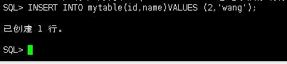

实验2  

  
第1步：以system登录到pdborcl，创建角色con_res_view和用户new_user，并授权和分配空间：
$ sqlplus system/123@pdborcl
SQL> CREATE ROLE con_res_view;
Role created.
SQL> GRANT connect,resource,CREATE VIEW TO con_res_view;
Grant succeeded.
SQL> CREATE USER new_user IDENTIFIED BY 123 DEFAULT TABLESPACE users TEMPORARY TABLESPACE temp;
User created.
SQL> ALTER USER new_user QUOTA 50M ON users;
User altered.
SQL> GRANT con_res_view TO new_user;
Grant succeeded.
SQL> exit

  
第2步：新用户new_user连接到pdborcl，创建表mytable和视图myview，插入数据，最后将myview的SELECT对象权限授予hr用户。
$ sqlplus new_user/123@pdborcl
SQL> show user;
USER is "NEW_USER"
SQL> CREATE TABLE mytable (id number,name varchar(50));
Table created.
SQL> INSERT INTO mytable(id,name)VALUES(1,'zhang');
1 row created.
SQL> INSERT INTO mytable(id,name)VALUES (2,'wang');
1 row created.
SQL> CREATE VIEW myview AS SELECT name FROM mytable;
View created.
SQL> SELECT * FROM myview;
NAME
--------------------------------------------------
zhang
wang
SQL> GRANT SELECT ON myview TO hr;
Grant succeeded.
SQL>exit

  
第3步：用户hr连接到pdborcl，查询new_user授予它的视图myview

  
查看表空间的数据库文件，以及每个文件的磁盘占用情况。

